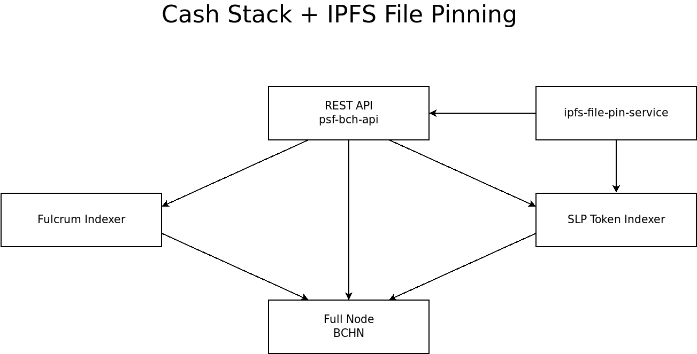

# ipfs-file-pin-service

[ipfs-file-pin-service](https://github.com/Permissionless-Software-Foundation/ipfs-file-pin-service) is an **optional** component of the IPFS layer in the [Cash Stack](/docs/intro). It runs a [Helia](https://github.com/ipfs/helia) IPFS node and a REST API server that provides **paid IPFS file pinning** using the [PSF File Pinning Protocol (PS010)](https://github.com/Permissionless-Software-Foundation/specifications/blob/master/ps010-file-pinning-protocol.md). This code base was forked from [ipfs-service-provider](https://github.com/Permissionless-Software-Foundation/ipfs-service-provider).



ipfs-file-pin-service sits at the top of the Cash Stack and depends on two pieces of infrastructure below it:

- [SLP Token Indexer](/docs/back-end/slp-indexer/slp-indexer-software) &mdash; When the indexer detects a new [Pin Claim](https://github.com/Permissionless-Software-Foundation/specifications/blob/master/ps010-file-pinning-protocol.md) transaction on the blockchain, it fires a webhook to notify ipfs-file-pin-service.
- [psf-bch-api](/docs/back-end/psf-bch-api) &mdash; Used to interact with the BCH blockchain for validating proof-of-burn transactions.

When a Pin Claim is detected, the service:

1. Validates that a proper proof-of-burn of PSF tokens was submitted with the claim.
2. Verifies that the burn amount meets the required cost based on file size.
3. Downloads the IPFS content and pins it to the local Helia node.
4. Serves the pinned content via HTTP download and view endpoints.

The result of several of these nodes running independently across the internet is that pinned files are **redundantly hosted** across the network, creating censorship-resistant file storage without a central server.

## Features

- **Blockchain-Validated Pinning** &mdash; Processes Pin Claims from the Bitcoin Cash blockchain and validates proof-of-burn transactions against the PSF token write price set by the [PSF Minting Council](https://PSFoundation.cash).
- **Embedded Helia IPFS Node** &mdash; Runs a full Helia IPFS node with TCP, WebSocket, and optional WebRTC transports. Supports circuit relay for nodes behind NATs/firewalls.
- **Dual API Interface** &mdash; Exposes both a REST API over HTTP and a JSON-RPC API over IPFS for decentralized access.
- **File Downloads and Viewing** &mdash; Serves pinned content via HTTP endpoints for direct file download and in-browser viewing.
- **Automatic Retry Queue** &mdash; Failed downloads are retried with a concurrent queue (up to 20 parallel downloads, 5-minute timeout per attempt).
- **Pin Renewals** &mdash; Supports renewing pins with additional proof-of-burn transactions.
- **Dynamic Pricing** &mdash; Fetches the current write price from the PSF Minting Council at startup so pin costs stay in sync with token valuation. If the lookup fails, it falls back to a safe hardcoded price.
- **Periodic Maintenance** &mdash; Timer-based controllers handle pin processing (every 10 minutes), usage cleanup (every hour), and automatic restarts (every 6 hours).

## Links

- [ipfs-file-pin-service](https://github.com/Permissionless-Software-Foundation/ipfs-file-pin-service) &mdash; Source code and Docker containers
- [PSF File Pinning Protocol (PS010)](https://github.com/Permissionless-Software-Foundation/specifications/blob/master/ps010-file-pinning-protocol.md) &mdash; The specification this service implements
- [explorer.psffpp.com](https://explorer.psffpp.com) &mdash; Web app for uploading files and generating Pin Claims
- [Decentralized File Hosting](/docs/IPFS/file-storage) &mdash; Overview of the IPFS file hosting layer
- [Telegram support channel](https://t.me/bch_js_toolkit) &mdash; Community technical support

## Videos

### Installing the ipfs-file-pin-service Docker Container

<iframe width="639" height="359" src="https://www.youtube.com/embed/H1TJEhd025A" title="Install ipfs-file-pin-service" frameborder="0" allow="accelerometer; autoplay; clipboard-write; encrypted-media; gyroscope; picture-in-picture; web-share; fullscreen" allowfullscreen></iframe>

#### Instructions

**Prerequisites:** You must have the following Cash Stack infrastructure fully synced and running before installing ipfs-file-pin-service:

- A fully synced [BCHN Full Node](/docs/back-end/bchn-full-node)
- A fully synced [Fulcrum Indexer](/docs/back-end/fulcrum-indexer)
- A fully synced [SLP Token Indexer](/docs/back-end/slp-indexer/slp-indexer-software)
- A running instance of [psf-bch-api](/docs/back-end/psf-bch-api) (recommended for CashBox deployments)

You can verify your infrastructure is healthy by checking the logs for each service. The SLP Token Indexer should be fully synced&mdash;the TX indexer should show periodic ZMQ check messages, indicating it is sitting idle and watching for new transactions.

---

#### Step 1: Configure the SLP Token Indexer Webhook

Before installing ipfs-file-pin-service, you must configure the SLP Token Indexer to send webhooks when it detects Pin Claim transactions. This is done by setting the `PIN_API_URL` environment variable in **both** the TX indexer and Block indexer `.env` files.

Navigate to your SLP indexer's production Docker directory:

```bash
cd psf-slp-indexer-g2/production/docker
```

Edit the `.env` file for the TX indexer:

```bash
nano tx-indexer/.env
```

Add or update this line:

```
PIN_API_URL=http://172.17.0.1:5031
```

Do the same for the Block indexer:

```bash
nano block-indexer/.env
```

```
PIN_API_URL=http://172.17.0.1:5031
```

:::tip
It is important to set the webhook URL in **both** the TX indexer and the Block indexer. The TX indexer provides real-time detection of Pin Claims as transactions hit the mempool, but it can occasionally miss a transaction. The Block indexer catches everything when a block is confirmed, ensuring no Pin Claims are lost.
:::

After editing both files, restart the SLP indexer containers to apply the changes:

```bash
docker compose down
docker compose up -d
```

---

#### Step 2: Clone the Repository

```bash
git clone https://github.com/Permissionless-Software-Foundation/ipfs-file-pin-service
cd ipfs-file-pin-service
```

---

#### Step 3: Navigate to the Production Docker Directory

```bash
cd production/docker
```

This directory contains the `Dockerfile`, `docker compose.yml`, and `start-production.sh` shell script that configures the application through environment variables.

---

#### Step 4: Configure Environment Variables

Edit the `start-production.sh` file to configure your deployment:

```bash
nano start-production.sh
```

There are several settings to review:

**Mnemonic (recommended to change):**

Replace the default mnemonic with your own 12-word mnemonic. You can generate one at [wallet.psfoundation.info](https://wallet.psfoundation.info). This mnemonic is used to set up a persistent public key for end-to-end encryption and a payment address for the IPFS node.

```bash
export MNEMONIC="your twelve word mnemonic goes here replace this with your own"
```

**Node Name (recommended to change):**

Give your IPFS node a unique, human-readable name on the network:

```bash
export COORD_NAME=my-pin-service-node
```

**Wallet Interface (recommended for CashBox):**

By default, ipfs-file-pin-service uses the `web3` interface, which connects to the free public BCH infrastructure over IPFS. This works out of the box but is slow because it relies on third-party infrastructure. If you are running a CashBox or have a local instance of [psf-bch-api](/docs/back-end/psf-bch-api), you should enable the `web2` interface and point it at your local REST API:

```bash
export WALLET_INTERFACE=web2
export APISERVER=http://172.17.0.1:5942/v6/
```

This makes the service self-sufficient&mdash;it does not depend on any third-party infrastructure. It also makes startup and operations significantly faster.

:::tip
The `172.17.0.1` address is the Docker bridge gateway on Linux, which allows containers to reach services running on the host machine. If psf-bch-api is running in a Docker container on the same machine, this address will work. Adjust the port to match your psf-bch-api configuration.
:::

**Connection Preference:**

If your IPFS node has a publicly accessible IP address (not behind a NAT or firewall), you can set the connection preference to `direct`. Otherwise, leave it as `cr` (circuit relay):

```bash
# For publicly accessible nodes:
export CONNECT_PREF=direct

# For nodes behind NAT/firewall (default):
export CONNECT_PREF=cr
```

---

#### Step 5: Build and Start the Docker Containers

```bash
docker compose build --no-cache
docker compose up -d
```

This starts two containers:

| Container              | Description                      | Ports                                      |
|------------------------|----------------------------------|--------------------------------------------|
| `mongo-file-service`   | MongoDB 4.2 database             | `5556` -> `27017`                          |
| `file-service`         | Application server               | `5031` (REST), `4001` (TCP), `4003` (WS), `4005` (WebRTC) |

---

#### Step 6: Monitor the Startup

```bash
docker compose logs -f file-service
```

When the service first starts up, the REST API is not immediately available. The service performs a startup sequence where it validates the current write price from the PSF Minting Council directly from the blockchain. This involves a significant computational and API load but only happens once at startup. It ensures the service charges the correct price for file pinning based on the decentralized truth on the blockchain, rather than relying on a hardcoded value.

Once the write price validation completes, the service begins listening on port `5031` and is ready to process Pin Claims.

:::info
If the write price validation fails (e.g., due to slow network connectivity), the service falls back to a safe hardcoded price. The truth is always on the blockchain&mdash;the hardcoded value is only a fallback.
:::

---

#### Step 7: Test the Installation

To verify that everything is wired up correctly, you can pin a file using [explorer.psffpp.com](https://explorer.psffpp.com):

1. Navigate to the **Upload** page on [explorer.psffpp.com](https://explorer.psffpp.com).
2. Select a file to upload (files under 1 MB will cost the minimum price).
3. Choose whether to pay with PSF tokens directly or with BCH.
4. Click **Upload** to add the file to the IPFS staging server.
5. Click **Pin File** to generate the Pin Claim transaction and burn the required PSF tokens.

Now monitor the logs on your SLP indexer and ipfs-file-pin-service:

```bash
# In one terminal, watch the SLP TX indexer:
docker logs -f tx-indexer

# In another terminal, watch ipfs-file-pin-service:
docker compose logs -f file-service
```

You should see the SLP indexer detect the Pin Claim transaction, fire the webhook, and then ipfs-file-pin-service react by validating the claim, checking the file size, downloading the file, and pinning it. A successful sequence looks like:

1. **Pin claim found** &mdash; The webhook was received from the SLP indexer.
2. **Validation succeeded** &mdash; The proof-of-burn meets the required cost.
3. **File downloaded** &mdash; The content was retrieved from the IPFS network.
4. **File pinned** &mdash; The content is now pinned to the local Helia node.

Once you see this, your ipfs-file-pin-service is running correctly. As new Pin Claims come in on the blockchain, the service will automatically detect, validate, and download them.

---

#### Step 8: Manage the Containers

```bash
# Stop the containers:
docker compose down

# Start the containers again:
docker compose up -d

# View logs:
docker compose logs -f file-service
```

---

## Configuration

The application is configured through environment variables set in `start-production.sh` (for Docker deployments) or in the shell environment (for development). All configuration is centralized in [config/env/common.js](https://github.com/Permissionless-Software-Foundation/ipfs-file-pin-service/blob/master/config/env/common.js), with environment-specific overrides in the `config/env/` directory.

### Server

| Variable              | Description                                        | Default                  |
|-----------------------|----------------------------------------------------|--------------------------|
| `PORT`                | REST API port                                      | `5031`                   |
| `SVC_ENV`             | Environment: `development`, `test`, or `prod`      | `development`            |
| `NO_MONGO`            | Disable MongoDB (set to any value to enable)       | *unset* (MongoDB enabled)|
| `ADMIN_PASSWORD`      | Admin account password                             | *unset*                  |
| `DISABLE_NEW_ACCOUNTS`| Disable new user account creation                  | *unset* (accounts enabled)|

### IPFS Node

| Variable               | Description                                                     | Default                  |
|------------------------|-----------------------------------------------------------------|--------------------------|
| `DISABLE_IPFS`         | Disable the IPFS node at startup (set to any value to disable)  | *unset* (IPFS enabled)   |
| `COORD_NAME`           | Human-readable name for the IPFS node                           | `ipfs-bch-wallet-service`|
| `DEBUG_LEVEL`          | helia-coord debug verbosity (0=none, 3=max)                     | `2`                      |
| `IPFS_TCP_PORT`        | IPFS TCP transport port                                         | `4001`                   |
| `IPFS_WS_PORT`         | IPFS WebSocket transport port                                   | `4003`                   |
| `IPFS_WEB_RTC_PORT`    | IPFS WebRTC transport port                                      | `4005`                   |
| `CONNECT_PREF`         | Connection preference: `cr` (circuit relay) or `direct`         | `cr`                     |
| `ENABLE_CIRCUIT_RELAY` | Enable circuit relay mode (node must not be behind a firewall)  | *unset* (disabled)       |
| `CR_DOMAIN`            | SSL domain for WebSocket circuit relay connections               | *unset*                  |
| `USE_WEB_RTC`          | Enable WebRTC transport                                         | `false`                  |

### Wallet

| Variable           | Description                                                         | Default                          |
|--------------------|---------------------------------------------------------------------|----------------------------------|
| `MNEMONIC`         | 12-word BCH mnemonic for encryption keys and payment address        | *empty* (required for production)|
| `WALLET_FILE`      | Path to a wallet file generated by psf-bch-wallet                   | `./wallet.json`                  |
| `WALLET_INTERFACE` | Wallet connection mode: `web3` (IPFS JSON-RPC) or `web2` (HTTP REST)| `web3`                          |
| `APISERVER`        | BCH API server URL (used with `web2` interface)                     | `https://api.fullstack.cash/v5/` |
| `WALLET_AUTH_PASS` | Basic auth password for the web2 API                                | *empty*                          |

:::tip
For CashBox deployments, set `WALLET_INTERFACE=web2` and `APISERVER=http://172.17.0.1:4952/v6/` to use your local psf-bch-api instance. This eliminates the dependency on third-party infrastructure and significantly improves performance.
:::

### File Pinning

| Variable         | Description                                        | Default                  |
|------------------|----------------------------------------------------|--------------------------|
| `MAX_PIN_SIZE`   | Maximum allowable file size in bytes                | `100000000` (100 MB)     |
| `REQ_TOKEN_QTY`  | Default PSF tokens required per MB (overridden by Minting Council lookup) | `0.03570889` |
| `DOMAIN_NAME`    | Base URL for file download links                   | `http://localhost:5031`  |

### Database

| Environment   | Connection String                                  |
|---------------|----------------------------------------------------|
| Development   | `mongodb://localhost:27017/ipfs-file-pin-dev`      |
| Test          | `mongodb://localhost:27017/ipfs-file-pin-test`     |
| Production    | `mongodb://172.17.0.1:5556/ipfs-service-prod` (or override with `DBURL`) |

---

## REST API Endpoints

The REST API is served on the configured `PORT` (default `5031`).

### IPFS (`/ipfs`)

| Method | Endpoint                   | Description                              |
|--------|----------------------------|------------------------------------------|
| GET    | `/ipfs`                    | Get IPFS node status                     |
| POST   | `/ipfs/peers`              | List connected peers                     |
| POST   | `/ipfs/relays`             | List circuit relay connections            |
| POST   | `/ipfs/connect`            | Connect to a specific peer               |
| POST   | `/ipfs/pin-claim`          | Submit a pin claim (webhook endpoint)    |
| GET    | `/ipfs/pin-status/:cid`    | Get pin status for a CID                |
| GET    | `/ipfs/pins/:page`         | List pins (paginated, 20 per page)       |
| GET    | `/ipfs/unprocessed-pins`   | List unprocessed pin claims              |
| POST   | `/ipfs/pin-local-file`     | Upload and pin a file via HTTP           |
| GET    | `/ipfs/download/:cid/:name?` | Download a pinned file                 |
| GET    | `/ipfs/view/:cid/:name?`  | View a pinned file in the browser        |
| GET    | `/ipfs/download-cid/:cid`  | Download any CID from the IPFS network  |
| GET    | `/ipfs/node`               | Get this node's IPFS identity            |

### JSON-RPC API (over IPFS)

In addition to the REST API, the service exposes a JSON-RPC interface over IPFS using [helia-coord](https://www.npmjs.com/package/helia-coord). This allows decentralized access without a direct HTTP connection. Available RPC methods include `pinClaim`, `getFileMetadata`, `getPins`, `users`, `auth`, and `about`.

[psf-bch-wallet](https://github.com/Permissionless-Software-Foundation/psf-bch-wallet) is a CLI tool that can interact with this JSON-RPC API. See the [Reduce Server Costs](/docs/IPFS/reduce-server-costs) documentation for more on `psf-bch-wallet`.

---

## Architecture

This repository follows [Clean Architecture](https://christroutner.github.io/trouts-blog/blog/clean-architecture) principles:

```
src/
├── adapters/          # Interfaces to external services (IPFS, MongoDB, wallet)
│   ├── ipfs/          # Helia IPFS node adapter
│   ├── localdb/       # Mongoose models and database adapter
│   └── wallet.adapter.js
├── controllers/       # Input handlers
│   ├── rest-api/      # Koa REST API routes and middleware
│   ├── json-rpc/      # JSON-RPC handlers (over IPFS)
│   └── timer-controllers.js  # Periodic tasks (pin processing, cleanup)
├── entities/          # Business logic validation
└── use-cases/         # Application business rules
```

---

## Development Environment

If you want to modify the code and contribute, you can run ipfs-file-pin-service outside of Docker:

```bash
git clone https://github.com/Permissionless-Software-Foundation/ipfs-file-pin-service
cd ipfs-file-pin-service
./install-mongo.sh
npm install
npm start
```

The development server starts on port `5031` by default and connects to a local MongoDB instance at `mongodb://localhost:27017/ipfs-file-pin-dev`.

### Running Tests

| Command                | Description                       |
|------------------------|-----------------------------------|
| `npm start`            | Start the server                  |
| `npm test`             | Run unit tests                    |
| `npm run test:all`     | Run unit and e2e tests            |
| `npm run test:e2e:auto`| Run e2e tests only                |
| `npm run lint`         | Lint code with Standard.js        |
| `npm run docs`         | Generate API documentation        |
| `npm run coverage:report` | Generate HTML coverage report  |
