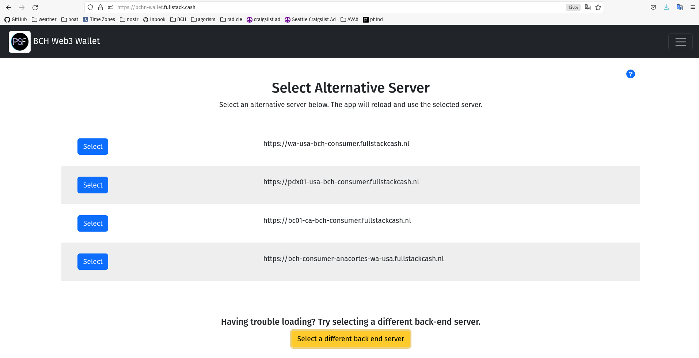

# Web Apps

The Cash Stack includes React templates for creating a web-based, non-custodial wallet. It includes [Capacitor](https://capacitorjs.com/) libraries to easily compile the apps into iOS and Android phone apps. The structure allows developers to fork their own white-labeled wallet, then quickly build and share extensions to the wallet app.

## React SPA
The fastest way to build a web app that communicates with a blockchain is the [react-bootstrap-web3-spa template](https://github.com/Permissionless-Software-Foundation/react-bootstrap-web3-spa). This template starts with [Create React App](https://create-react-app.dev/) and adds the [React Bootstrap library](https://react-bootstrap.github.io/) for easy layout. It also contains the [minimal-slp-wallet library](https://www.npmjs.com/package/minimal-slp-wallet) for interacting with the BCH blockchain. This template is appropriate for building any general-purpose blockchain-based app, as opposed to just a wallet.

## White-Label Wallet
[bch-wallet-web3-spa](https://github.com/Permissionless-Software-Foundation/bch-wallet-web3-spa) is forked from the above template. A live version of this code repository is available at [wallet.psfoundation.info](https://wallet.psfoundation.info). It has additional React components added to create a wallet with basic functionality:
- Send and receive BCH
- Send and recieve Tokens
- Display token icons
- Backup, restore, and optimize the wallet
- Sweep BCH and tokens from a paper wallet
- Sign a message cryptographically

## Back End Service
The web wallet will need to connect to an instance of [ipfs-bch-wallet-consumer](/docs/intro) in order to communicate with the blockchain. You can run that service yourself, or you can use wallet services provided by the PSF community. The wallet service can be chosen by clicking the button at the bottom of the screen labeled 'Select a different back end server'.

No private information (keys, mnemonics, etc) is ever sent to the back end service. The service simply provides access to the blockchain and indexers, so the web wallet can query data and broadcast transactions.

The list of community-provided wallet services is dynamically loaded from [this JSON file](https://consumers.psfoundation.info/consumers.json). To run your own wallet service, you'll need to install the [Local Back End](/docs/local-back-end).

## minimal-slp-wallet

[minimal-slp-wallet](https://www.npmjs.com/package/minimal-slp-wallet) is a JavaScript library compiled for use in a front end browser app. It provides basic wallet functionality for working with BCH and SLP tokens. It can be configured to operate on either the Web 2 or Web 3 architecture. It also has an instance of [bch-js](https://bchjs.fullstack.cash/) embedded into the library.

## Example Apps

Below is a list of example applications that have been built with the Cash Stack. The source code for each app is available for you to fork and hack on.

### Wallet.FullStack.Cash

[wallet.psfoundation.info](https://wallet.psfoundation.info) is an open source, white-label wallet. It provides a foundation upon which to build additional functionality. We encourage developers and businesses to fork this code base and customize it for their own needs.

- [Live Demo](https://wallet.psfoundation.info)
- [Source Code](https://github.com/Permissionless-Software-Foundation/bch-wallet-web3-spa)

### NFT Creator

NFTs are the future of digital assets. They can represent anything from concert tickets, to works of art, to news items, to membership in a club, to just about anything you can imagine. Creating NFTs needs to be cheap and easy. This app let's you create an NFT in a few seconds for only a few cents of BCH.

- [Live Demo](https://nft-creator.fullstack.cash/)
- [Source Code](https://github.com/Permissionless-Software-Foundation/token-studio)

### NFT Collector

What good is it to create NFTs if you can't show them off?! The NFT Collector app will display any NFTs held by a Bitcoin Cash address. The address can be passed as part of the URL, which makes it easy to share on social media.

- [Live Demo](https://nft-collector.fullstack.cash/?addr=bitcoincash:qzsgnyd826c6xw5y3y4ct6q2gvf3r8fmkqfvtzn6ef)
- [Source Code](https://github.com/Permissionless-Software-Foundation/nft-collection)

### Balance Checker

This is a simple demo of the React SPA template. Given a BCH address, it will report the balance for that address, similar to a block explorer. This a great beginner app for developers to start hacking on.

- [Live Demo](https://permissionless-software-foundation.github.io/react-bootstrap-web3-spa/)
- [Source Code](https://github.com/Permissionless-Software-Foundation/react-bootstrap-web3-spa)

### Address Conversion

There are a lot of different address formats used in crypto. This app is a slight variation on the Balance Checker app above. Given a BCH, SLP, legacy BTC, or eCash address, the app will convert it into its different address formats.

- [Live Demo](https://address.fullstack.cash/)
- [Source Code](https://github.com/Permissionless-Software-Foundation/web-app-address-conversion)

### Telegram and Discord Bots

Crypto is all about community. But in order to communicate with your community, you must be able to filter out noise makers and spam bots.

We created a custom chat bot that silences all newcomers by default. They can gain the ability to speak in your Telegram or Discord channel by completing a challenge, such as signing a message with the web wallet or claiming a token.

Click the button below to join the PSF Telegram channel and try it out for yourself.

- [PSF Telegram channel](https://t.me/permissionless_software)
- [Source Code](https://github.com/christroutner/vip-bot)

### Decentralized Exchange

Still under development, the PSF is in the process of building out a decentralized exchange (DEX) for trading SLP tokens on the BCH blockchain. These DEX's can be used to buy and sell fungible tokens and NFTs.

The protocol we've developed is trustless, atomic, non-custodial, and peer-to-peer. These are important qualities that distinguish it from other DEXs in the industry. Learn more by visiting the demo.

- [Live Demo](https://dex.psfoundation.info)
- [Source Code](https://github.com/Permissionless-Software-Foundation/bch-dex)
- [Documentation](https://dex-docs.psfoundation.info)
