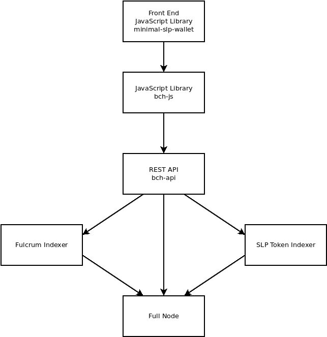

# bch-api REST API

[bch-api](https://github.com/Permissionless-Software-Foundation/bch-api) is a REST API server, written in node.js JavaScript, using the [Express.js](https://expressjs.com/) framework. The purpose of this code is to create a REST API server that provides a common interface for developers to build blockchain-based business applications. This software works with the Bitcoin Cash (BCH) and eCash (XEC) blockchains.

## Links

- [bch-api](https://github.com/Permissionless-Software-Foundation/bch-api) Docker containers
- [API Reference Documentation](https://api.fullstack.cash/docs/)

## Videos

### Part 1 - Installing bch-api

<iframe width="540" height="295" src="https://www.youtube.com/embed/D0pMYpGhOco" title="Install bch-api" frameborder="0" allow="accelerometer; autoplay; clipboard-write; encrypted-media; gyroscope; picture-in-picture; web-share" allowfullscreen></iframe>
