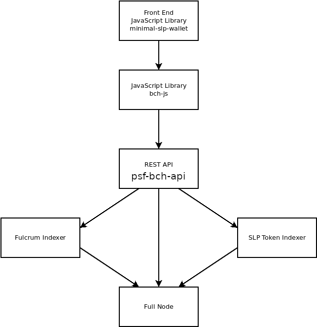

# Introduction

The Cash Stack is a framework for building blockchain-based web and phone applications. It allows modern 'web2' applications to access these decentralized 'web3' primitives:

- **Money** transfer using Bitcoin Cash (BCH)
- **Tokenization** to create fungible tokens and NFTs
- **File Hosting** using IPFS
- **Encrypted Messaging** using a combination of technologies
- **Social Media** using Nostr

Currently the focus is on the Bitcoin Cash blockchain, but the infrastructure may be expanded some day to other blockchains like eCash (XEC), AVAX X-Chain, and other UTXO-based blockchains. The Cash Stack sets itself apart from other software and blockchain-based frameworks by placing strong emphasis on the following areas:

- **Censorship Resistance**: circumventing State or corporate attempts to block or tamper with data.
- **Self Sufficiency**: reducing or eliminating dependency on third parties.
- **JavaScript** is the only programming language used.
- **Docker Compose** is used to orchestrate the different sub-components. If you view the software subcomponents as 'lego blocks', Docker Compose is used to assemble the blocks into a functional application.
- **Ubuntu Linux** is the target operating system for all software.

The Cash Stack is maintained by the [Permissionless Software Foundation](https://psfoundation.info). It is the primary tool used to fulfil the PSF mission to *develop, promote, and maintain software that makes it easy for individuals to protect their privacy, circumvent censorship, and engage in economic activity.*

The Cash Stack is not just a library or even a single repository. It is a collection of code repositories that are orchestrated much like Lego blocks. Many of the pieces are interchangeable and re-configurable. This allows a wide range of business applications to be built.

All Cash Stack infrastructure can run on a standard, desktop computer with 32 GB of RAM, 1TB SSD hard drive, and the Ubuntu Linux operating system. These typically cost about $400 USD. With just a computer and an internet connection, this infrastructure can serve between 1,000 and 10,000 users (or about 2 million API requests per day) and be maintained by a single individual. Computers can be scaled in parallel for larger applications.

The Cash Stack is infrastructure for communities and entrepreneurs. It allows experimentation with local currencies (tokens), international hard money (cryptocurrency), secure communication, censorship-resistant data, and unregulated social media.

## Support

If you have questions or need technical support, the PSF community maintains [this Telegram channel for technical discussions](https://t.me/bch_js_toolkit) and [this Telegram channel for governance discussions](https://t.me/permissionless_software). When asking questions, keep in mind that this is an open source project. The channel is for community members to support one another, but no one is paid or expected to help anyone who is rude.

## The Basic Software Stack

The Cash Stack is inspired by the [OSI model](https://www.bmc.com/blogs/osi-model-7-layers/). It helps software developers discuss technical issues, by framing the conversation with regard to 'which layer in the stack' any one particular issue lives. This makes it easier to isolate (and ultimately fix) networking issues.

This model applies to all blockchain-based applications, regardless of the specific blockchain used. For example, this model applies to BTC, BCH, XEC, BSV, ETH, and AVAX.

The layers of the stack show the path that data travels between an app and the blockchain. Here is an explanation of each layer:

- **Application** is the end-user software. The wallet, trading app, social media, or other app that the user interacts with directly. In addition to the user interface (UI), this layer also includes *application libraries* which include business logic and high-level abstractions.

- **Interface Library** is the library that *application libraries* call in order to interact with the blockchain or other web3 back end resource. In many cases, this layer is made up of [bch-js](https://www.npmjs.com/package/@psf/bch-js), [bch-consumer](https://www.npmjs.com/package/bch-consumer), or their various extension libraries.

- **API** is either a REST API or JSON RPC server software. This layer is called by the layer above it (the interface library), for the purpose of communicating across the internet. The API provides a single interface for applications to call, in order to indirectly interact with back end services like databases, indexers, and full nodes.

- **Indexers** are like small search engines, which crawl the blockchain data, and piece together metadata that is not directly available from the raw blockchain. An example of this is the [Fulcrum](https://github.com/Permissionless-Software-Foundation/docker-fulcrum) indexer, which is responsible for tracking address balances, transaction history, and UTXOs. Another common indexer is the [psf-slp-indexer](https://github.com/Permissionless-Software-Foundation/psf-slp-indexer), which tracks all SLP tokens on the blockchain.

- **Full Nodes** are the most basic blockchain software. This is the software that interacts directly with the blockchain, by broadcasting transactions and verifying new blocks. Full Nodes often use a JSON RPC or REST API to communicate.

## Architecture

The same stack can be visualized below as a *dependency graph*. Viewed this way, it can be seen that [psf-bch-api](back-end/psf-bch-api) is the heart of the Cash Stack. It's a REST API server that creates [a single web2 interface](https://bch.fullstack.cash) to talk to the all the other blockchain infrastructure: 
- Full node
- Fulcrum indexer
- SLP Token Indexer.

[Learn more about psf-bch-api.](back-end/psf-bch-api)
