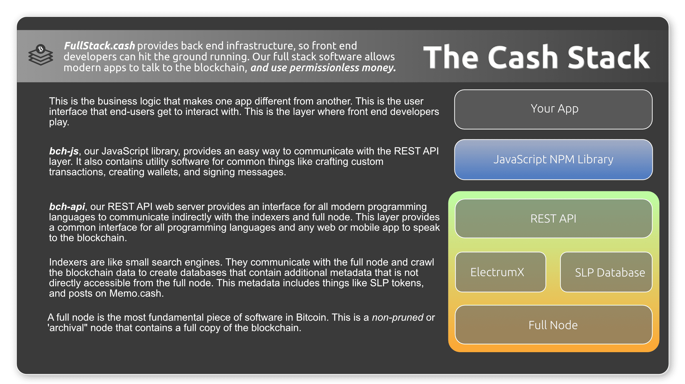

# Introduction

The Cash Stack is a framework for building blockchain-based web and phone applications. It allows modern 'web2' applications to access these decentralized 'web3' primitives:

- **Money** transfer using Bitcoin Cash (BCH)
- **Tokenization** to create fungible tokens and NFTs
- **File Hosting** using IPFS
- **Encrypted Messaging** using a combination of technologies
- **Social Media** using Nostr

Currently the focus is on the Bitcoin Cash blockchain, but the infrastructure may be expanded some day to other blockchains like eCash (XEC), AVAX X-Chain, and other UTXO-based blockchains. The Cash Stack sets itself apart from other software and blockchain-based frameworks by placing strong emphasis on the following areas:

- **Censorship Resistance**: circumventing State or corporate attempts to block or tamper with data.
- **Self Sufficiency**: reducing or eliminating dependency on third parties.
- **JavaScript** is the only programming language used.
- **Docker Compose** is used to orchestrate the different sub-components. If you view the software subcomponents as 'lego blocks', Docker Compose is used to assemble the blocks into a functional application.
- **Ubuntu Linux** is the target operating system for all software.

The Cash Stack is maintained by the [Permissionless Software Foundation](https://psfoundation.info). It is the primary tool used to fulfil the PSF mission to *develop, promote, and maintain software that makes it easy for individuals to protect their privacy, circumvent censorship, and engage in economic activity.*

The Cash Stack is not just a library or even a single repository. It is a collection of code repositories that are orchestrated much like Lego blocks. Many of the pieces are interchangeable and re-configurable. This allows a wide range of business applications to be built.

All Cash Stack infrastructure can run on a standard, desktop computer with 32 GB of RAM, 1TB SSD hard drive, and the Ubuntu Linux operating system. These typically cost about $400 USD. With just a computer and an internet connection, this infrastructure can serve between 1,000 and 10,000 users (or about 2 million API requests per day) and be maintained by a single individual. Computers can be scaled in parallel for larger applications.

The Cash Stack is infrastructure for communities and entrepreneurs. It allows experimentation with local currencies (tokens), international hard money (cryptocurrency), secure communication, censorship-resistant data, and unregulated social media.

## Support

If you have questions or need technical support, the PSF community maintains [this Telegram channel for technical discussions](https://t.me/bch_js_toolkit) and [this Telegram channel for governance discussions](https://t.me/permissionless_software). When asking questions, keep in mind that this is an open source project. The channel is for community members to support one another, but no one is paid or expected to help anyone who is rude.

## The Basic Software Stack

The Cash Stack is inspired by the [OSI model](https://www.bmc.com/blogs/osi-model-7-layers/). It helps software developers discuss technical issues, by framing the conversation with regard to 'which layer in the stack' any one particular issue lives. This makes it easier to isolate (and ultimately fix) networking issues.

This model applies to all blockchain-based applications, regardless of the specific blockchain used. For example, this model applies to BTC, BCH, XEC, BSV, ETH, and AVAX.

The layers of the stack show the path that data travels between an app and the blockchain. Here is an explanation of each layer:

- **Application** is the end-user software. The wallet, trading app, social media, or other app that the user interacts with directly. In addition to the user interface (UI), this layer also includes *application libraries* which include business logic and high-level abstractions.

- **Interface Library** is the library that *application libraries* call in order to interact with the blockchain or other web3 back end resource. In many cases, this layer is made up of [bch-js](https://www.npmjs.com/package/@psf/bch-js), [bch-consumer](https://www.npmjs.com/package/bch-consumer), or their various extension libraries.

- **API** is either a REST API or JSON RPC server software. This layer is called by the layer above it (the interface library), for the purpose of communicating across the internet. The API provides a single interface for applications to call, in order to indirectly interact with back end services like databases, indexers, and full nodes.

- **Indexers** are like small search engines, which crawl the blockchain data, and piece together metadata that is not directly available from the raw blockchain. An example of this is the [Fulcrum](https://github.com/Permissionless-Software-Foundation/docker-fulcrum) indexer, which is responsible for tracking address balances, transaction history, and UTXOs. Another common indexer is the [psf-slp-indexer](https://github.com/Permissionless-Software-Foundation/psf-slp-indexer), which tracks all SLP tokens on the blockchain.

- **Full Nodes** are the most basic blockchain software. This is the software that interacts directly with the blockchain, by broadcasting transactions and verifying new blocks. Full Nodes often use a JSON RPC or REST API to communicate.

## Web 2

The Cash Stack was originally conceived to help communicate the software layers used by [FullStack.cash](https://fullstack.cash) and [Bitcoin.com](https://bitcoin.com/), to show how software developers can use it to build apps on the Bitcoin Cash (BCH) blockchain. But when abstracted as above, the same conceptual framework applies to all blockchains.

Below is a more specific implementation of the Cash Stack that is used by [FullStack.cash](https://fullstack.cash) for working with the Bitcoin Cash (BCH) and eCash (XEC) blockchains:

The web 2 app is usually broken up into to a 'front end' and a 'back end'. Many software developers specialize in one of these areas. Services like [FullStack.cash](https://fullstack.cash) provide the back end infrastructure-as-a-service.

The achilles heel of this model is censorship. It's fragile in the face of any censorship. There are well-established industry best practices for censoring this architecture.

This architecture is also expensive. It's not practical to run this architecture from a home server. Cloud infrastructure is required in all but the most exceptional of cases. Cloud infrastructure has a monthly cost. Stop paying and the infrastructure disappears like smoke. Hobby developers may be able to run this infrastructure at home, but they can not break out of the hobby-category without funding.

## Web 3

The Web 3.0 Cash Stack inserts a new layer into the middle of the stack. This is called the 'IPFS Layer' and it contains two pieces of software which are mirror images of one another:

- *[IPFS Service Consumer](/docs/local-back-end/ipfs-bch-wallet-consumer)* - Provides a light-weight 'local' REST API, that proxies calls to a 'global' back end, over IPFS.
- *[IPFS Service Provider](/docs/global-back-end/ipfs-bch-wallet-service)* - Receives data over IPFS, and proxies the network calls to the compute-heavy 'global' back end infrastructure.

Front end developers can run *IPFS Service Consumer* as a light-weight 'local' back end. This pipes their network calls over the IPFS network to a remote 'global' back end. This reduces costs, improves reliability, and allows the p2p network to be built from home hardware and internet connections instead of centralized cloud servers.

By adding these two new pieces of software, it decouples the expensive 'global' back end infrastructure, and proxies it to a much less expensive 'local' back end REST API. This has several advantages:

- Because IPFS automatically handles the complex networking, it's much more pragmatic to run the expensive, global back end infrastructure from a home internet connection. This reduces the greatest cost of the Web 2.0 model.  
- By leveraging a p2p network of home computers, this architecture is extremely resistant to attempts at censorship.  
- Because of the decoupling, the _local back end_ is capable of using one-of-many instances of the _global back end_. It only needs to connect to one in order to succeed, and it can choose any instance on the network.

If implemented correctly, the performance should be acceptable to the end-users. The extra IPFS layers add some latency, but it provides much lower cost. Whether this architecture is appropriate for end-users depends on the specific application. If there is no company to pay for web 2.0 architecture, this web 3.0 architecture may be the only pragmatic way for communities to set up financial infrastructure.

This architecture really exceeds at censorship resistance, and providing low-cost infrastructure for hobbyists developers and local communities. Developers unfamiliar with running back end infrastructure, who want to focus primarily on front end applications, can run a single, simple app to provide the [Local Back End](/docs/local-back-end). Developers more comfortable with Dev Ops and running back end infrastructure, can provide the [Global Back End](/docs/global-back-end) infrastructure to the rest of the community, from the comfort (and cost-savings) of their own home. The [Permissionless Software Foundation](https://psfoundation.info) (PSF) is offering [Bounties](https://github.com/Permissionless-Software-Foundation/bounties) to incentivize hobby developers to run this global back end infrastructure.

The rest of this documentation walks through the various software packages that the PSF maintains, and how they fit into the Cash Stack.
