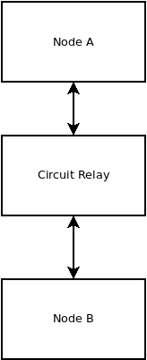

# Circuit Relays

An [IPFS Circuit Relay](https://docs.libp2p.io/concepts/circuit-relay/) is an IPFS node that can help two other IPFS nodes communicate across the internet, when a firewall would otherwise block them from talking to one another.

Circuit Relays are a critical piece in the censorship resistance, and are a core element in forming a mesh network. But not everyone needs to run one. Only a few circuit relays need to exist on the network for everyone else to enjoy a high-uptime, censorship-resistant experience.

In the Cash Stack, Circuit Relays are operated by running the [ipfs-service-provider](https://github.com/Permissionless-Software-Foundation/ipfs-service-provider) software. Requirements for successfully operating one are described in the [Circuit Relay Bounty](https://github.com/Permissionless-Software-Foundation/bounties/blob/master/bounties/active/circuit-relays.md). These are light-weight and inexpensive to operate, but they have specific requirements around their connection to the internet.

## Network Configuration

The core dependency of [ipfs-service-provider](https://github.com/Permissionless-Software-Foundation/ipfs-service-provider) is the [ipfs-coord](https://www.npmjs.com/package/ipfs-coord) library. `ipfs-coord` controls the IPFS node and forms a mesh network with other nodes running PSF software.

All other PSF software that is based on IPFS will automatically find and connect to Circuit Relays, eliminating any complex setup. But creating a Circuit Relay requires a specific network configuration:

- The Circuit Relay requires a public ipv4 or ipv6 address.
- The `ENABLE_CIRCUIT_RELAY` environment variable must be set to a value of 1
- In order to provide network access to browser-based IPFS nodes, the Circuit Relay must be available over secure websockets, which requires a registered domain name with an SSL certificate.

## Videos

### Installing ipfs-service-provider

<iframe width="540" height="295" src="https://www.youtube.com/embed/Z0NsboIVN44" title="Setting up a Circuit Relay" frameborder="0" allow="accelerometer; autoplay; clipboard-write; encrypted-media; gyroscope; picture-in-picture; web-share" allowfullscreen></iframe>

### Installing a Let's Encrypt SSL Certificate

<iframe width="540" height="295" src="https://www.youtube.com/embed/3UsgCUPFmx0" title="Setup a Let&#39;s Encrypt SSL Certificate" frameborder="0" allow="accelerometer; autoplay; clipboard-write; encrypted-media; gyroscope; picture-in-picture; web-share" allowfullscreen></iframe>
